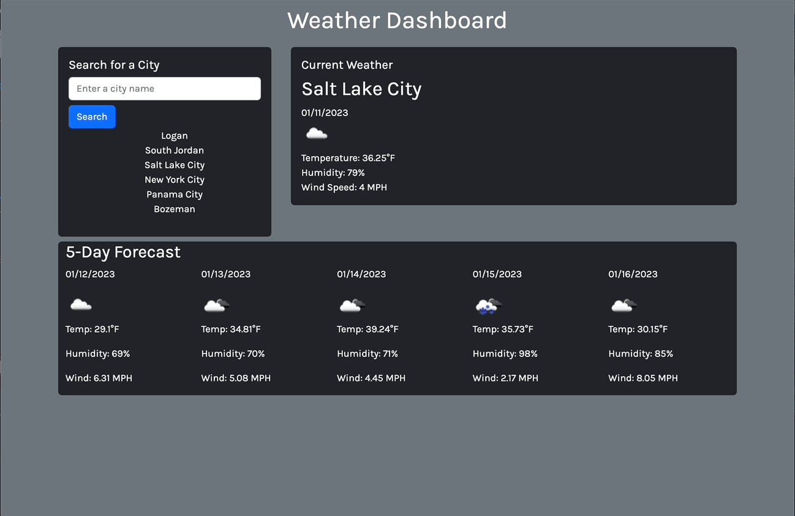

# Weather Dashboard

## Technology Used 

| Technology Used         | Resource URL           | 
| ------------- |:-------------:| 
|  JavaScript | [https://developer.mozilla.org/en-US/docs/Web/JavaScript](https://developer.mozilla.org/en-US/docs/Web/JavaScript)     |  
|  HTML    | [https://developer.mozilla.org/en-US/docs/Web/HTML](https://developer.mozilla.org/en-US/docs/Web/HTML) | 
|  CSS     | [https://developer.mozilla.org/en-US/docs/Web/CSS](https://developer.mozilla.org/en-US/docs/Web/CSS)      |   
|  Git | [https://git-scm.com/](https://git-scm.com/)     |
|  API | [https://developer.mozilla.org/en-US/docs/Web/API](https://developer.mozilla.org/en-US/docs/Web/API)     |   

## Description 

[Visit the Deployed Site](https://mccoydidericksen.github.io/weather-dashboard)

This web app allows users to check current weather conditions and 5-day forecast for any given city. The application utilizes the [OpenWeather API](https://openweathermap.org/api)  to query weather conditions and metrics. Users' search history will save as buttons to quickly view weather conditions for previously selected cities.

## Functionality


## Code Snippets
The below function builds the weather API query string based on user input and uses a fetch request to return the latitude and longitude of the city submitted by the user. These coordinates are then used in other API queries to obtain current weather conditions and 5-day forecasts. If the user enters an incorrect city name, a bootstrap modal pops up telling the user to submit a valid city name.

```javascript
function getCoordinates(city) {
  // format the coordinates api url
  var apiUrl = "https://api.openweathermap.org/data/2.5/weather?q=" + city + "&appid=" + apiKey;
  // make a request to the url
  fetch(apiUrl).then(function(response) {
    // request was successful
    if (response.ok) {
      response.json().then(function(data) {
        var lat = data.coord.lat;
        var lon = data.coord.lon;
        getWeather(lat, lon, city);
      });
    } else {
        $("#staticBackdropLabel").text("Error " + response.status);
        $(".modal-body").text("Please enter a valid city name.");
        $("#staticBackdrop").modal('show');
    }
  });
}
```
## Learning Points 

* Every third-party web API is different in how you interact and request data. A thorough reading of the API documentation and testing should be the first step in a web application that utilizes third-party data.